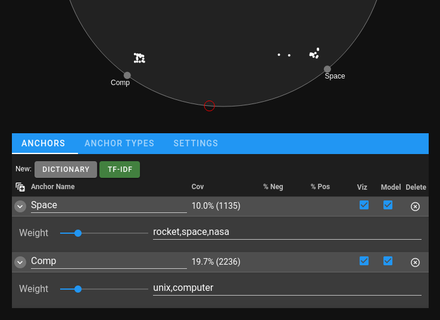

Getting Started
###############

Installation
============

The ICAT library itself can be installed via ``pip`` with:

.. code-block:: bash

    pip install icat-iml

ICAT is primarily intended to run in Jupyter, so it is recommended you
install and use either Jupyter Lab or Jupyter Notebook

Running
=======

To run ICAT, you have to first call ``initialize()``:

.. code-block:: python

    import icat
    icat.initialize()

To render the interface, create an icat ``Model`` with a pandas
dataframe with the data you want to explore and the name of the
column containing the text, and then execute ``.view`` at the end
of a cell:

.. code-block:: python

    model = icat.Model(my_data_df, "text_col")
    model.view

Simplest Example
================

Running the following two cells in a jupyter environment should
create a functioning interface:

.. code-block:: python

    import icat
    import pandas as pd
    from sklearn.datasets import fetch_20newsgroups

    icat.initialize()

.. code-block:: python

    train = fetch_20newsgroups(subset="train")
    train_df = pd.DataFrame({"text": train["data"]})
    model = icat.Model(train_df, "text")
    model.view

Basic Usage
===========

At its simplest, ICAT can be used as a visual and interactive
method for pulling out text instances by keywords. We can do this by creating dictionary
anchors (described further in :ref:`Anchors`) for the sets of keywords we wish to use: for example, to
separate out usenet posts in the "sci.space" category from any of the "comp."
categories, we could begin by creating two concept anchors, one with
"rocket,space,nasa" and another with "unix,computer". This can be done
either with the following code:

.. code-block:: python

    model.add_anchor(icat.DictionaryAnchor(anchor_name="Space", keywords=["rocket", "space", "nasa"]))
    model.add_anchor(icat.DictionaryAnchor(anchor_name="Comp", keywords=["unix", "computer"]))

Or by clicking on the "Dictionary" button twice and adding the comma-separated
keywords to the text fields below.

The result is shown above: the clusters of inner points (the texts) by each point along the
circumference (the anchors) represent the texts containing any of the anchor's
respective sets of keywords. The two points floating in between the two anchors
highlight instances that have keywords from both concept anchors.

A more comprehensive overview of using the interface can be found in the `usage
walkthrough notebook <https://github.com/ORNL/icat/blob/main/notebooks/usage_walkthrough.ipynb>`_.
