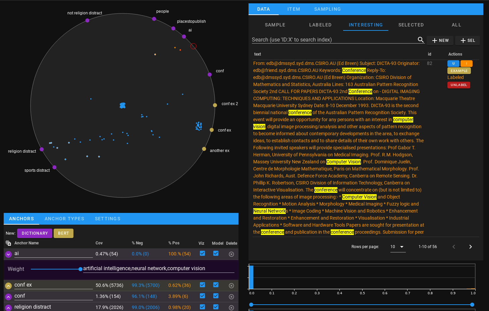
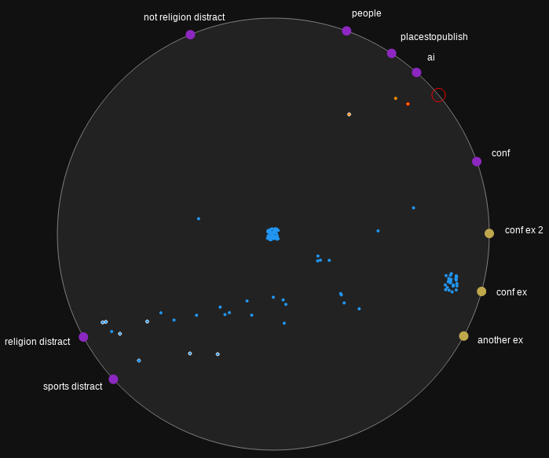
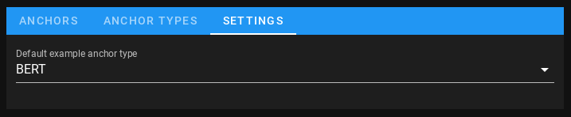
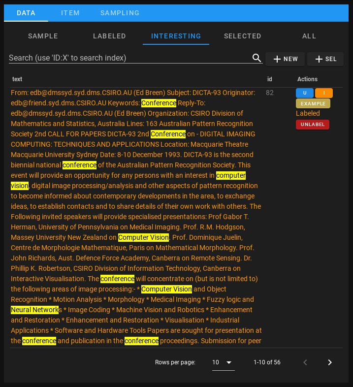
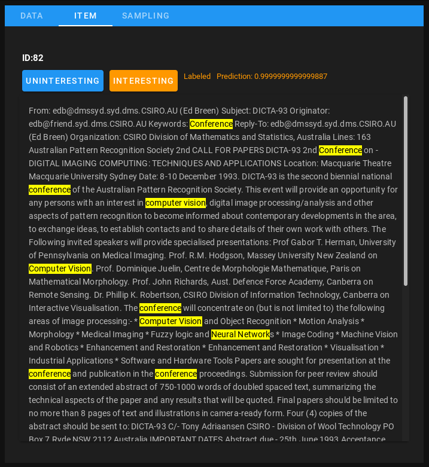
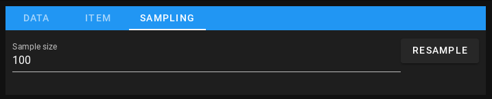

Interface
#########

The ICAT interface, pictured above, has three main components: the AnchorViz
ring, an anchor list, and a data manager.

This combined view is created by displaying ``model.view`` inside a jupyter cell
(either with an explicit ``IPython.display(model.view)`` or simply use
``model.view`` as the last line of the cell.)

AnchorViz
=========

AnchorViz is a visualization technique in IML literature by Chen, Nan-Chen, et
al.  `"AnchorViz: Facilitating classifier error discovery through interactive
semantic data exploration"
<https://dl.acm.org/doi/abs/10.1145/3172944.3172950>`_.  We implemented this
concept as a separate open source package `IPyAnchorViz
<https://github.com/ORNL/ipyanchorviz>`_ and utilize it here.

In AnchorViz, the larger points along the circumference ring are the anchors,
colored according to the anchor type they represent as discussed below. The
points inside the ring represent each individual item in the current sample, and
their location is determined by the amount of influence each anchor has on that
item. An item with a higher value in one feature than another will appear closer
to that anchor.

The anchors along the outside can be clicked and dragged around the
circumference, allowing the user to easily see which points are influenced by
it, and to utilize various strategies for manually teasing out different
clusters.

The empty red circle that travels around the circumference represents the
cursor, and it changes color based on possible actions. When it turns turquoise
(when your mouse cursor is close to the circumference), clicking will create a
new dictionary anchor at that location.  It will turn yellow when hovering over
an existing anchor, meaning if you click and drag the anchor will follow.

Before the model has been seeded all points appear white, and once the model
begins making predictions, the points are colored according to their prediction
- orange for interesting and blue for uninteresting.

Points in the middle can also have different colored outlines. A white outline
indicates that it was labeled by the user. Green indicates it is selected -
points can be lasso selected by clicking and dragging on the inside of the ring
and making a loop around a collection of points.

This part of the interface can be rendered separately with
``model.view.anchorviz``.

Anchor list
===========

This part of the interface can be rendered separately with ``model.anchor_list``.

Anchors
-------

.. figure:: ../_static/anchors.png
    :align: center

The anchors tab shows the full list of current anchors. The buttons along the
top after "New:" are anchor add buttons for each currently registered anchor
type (which can be modified from the anchor types tab.) Hovering over each
button will give a description of the anchor type.

Every anchor row is expandable/ collapsible using the colored arrow on the left
of the row (all anchors can be toggled simultaneously with the |expand-ico|
button.) The expanded content is defined by the anchor type, and
configures/controls the anchor content. In the dictionary anchor provided by
ICAT, (shown in purple in the screenshot), this is where you add the keywords to
search for.

The main row has 7 columns, which from left to right include:

* Anchor name - this is a text box that lets you rename the anchor. The anchor
  name is rendered as a text label in AnchorViz on the outside of the ring.
* Coverage - the percentage (and count) of items in the entire dataset that are
  influenced by this anchor.
* % Negative - the percentage (and count) of items that are influenced by this
  anchor and predicted to be **uninteresting**.
* % Positive - the percentage (and count) of items that are influenced by this
  anchor and predicted to be **interesting**.
* Viz - whether to show this anchor in AnchorViz or not.
* Model - whether to include this feature in the model during training or not.
* Delete - a button to remove the anchor.

Note that when the anchors are computing feature values for a dataset, a busy/
progress indicator will be active on the table as a whole as well as the feature
that is currently featurizing.

Anchor types
------------

.. figure:: ../_static/anchor_types.png
    :align: center

.. note::

    A type of anchor, or anchor subclass represents a way a feature is computed,
    which can be any arbitrary function that returns a value between 0 and 1.

The anchor types tab shows the current classes of anchor that are registered in
ICAT, allows you to control their name and color within ICAT's UI, and lists
any other anchor types that are within scope that haven't been registered yet.

For all anchor types listed, the full python class name is rendered beneath the
UI name textbox and the anchor's description below that (if defined).
To de-register an anchor type, click the "x" button next to its UI name textbox.

Adding anchor types directly in the interface is relatively straightforward - ICAT
automatically detects any subclasses (direct or indirect) of ``icat.Anchor``, and
lists them at the bottom with an "add" button. Clicking this button will register
it and include a new "anchor add" button in the main anchors list.

If a new anchor subclass has been defined or imported after ``model.view`` was run,
you can click the "refresh unused anchor types" button to re-list all currently
unregistered classes.

Settings
--------

Currently the only configuration item in Settings is the "Default example anchor
type", which changes the type of anchor that gets created when you click an
"Example" button in the data manager. This dropdown only gets populated with
anchor types that specifically subclass ``icat.anchors.SimilarityAnchorBase``,
as it's required to be able to take a target instance ID to compute similarity
against.

Data manager
============

This part of the interface can be rendered separately with ``model.data``.

Data
----

The data tab contains a set of subtabs to view tables with different subsets:

* Sample - the current randomly selected sample that is visible in AnchorViz.
* Labeled - all of the items the user has provided a label for.
* Interesting - once the model has been seeded, all items that the model has
  predicted are interesting.
* Selected - the set of items lasso-selected in anchorviz.
* All - the full dataset.

If the model has been seeded, the text column will render text in the color of
the predicted value - orange for interesting and blue for uninteresting.  Yellow
highlights show all text triggered on by dictionary anchors. Using the search
textbox will filter the current chosen subset to only entries containing the
search text. Search text can quickly be added to a dictionary anchor either with
the "+ new" button to create a new dictionary anchor, or "+ sel" to add it to
the currently selected dictionary anchor.

Every item has a collection of buttons in the Actions column:

* U - label this item as **uninteresting**.  I - label this item as
* **interesting**.  Example - create an example anchor with this item as the
  target. (See Settings to control what type of anchor gets created.)
* Sample - only shows if this item is not already in the current sample set.
  This button adds the given row to the sample set so that it shows in AnchorViz.
* Unlabel - only shows if this item has been labeled. Clicking resets the item
  and removes the label/from the training set.

The "Labeled" text that shows in the actions column for items that have been
labeled is colored according to what it was labeled as - orange for interesting
and blue for uninteresting

Item
----

Clicking on any item in the Data tab opens the item in the item tab, which
provides controls for labelling, shows the label status, as well as the
predicted value.

Sampling
--------

The sampling tab shows any sampling controls. Currently there are only two:

* Sample size - how many points to randomly draw when resampling (the default
  is 100).
* Resample - clicking this randomly selects a new sample based on sample size.
